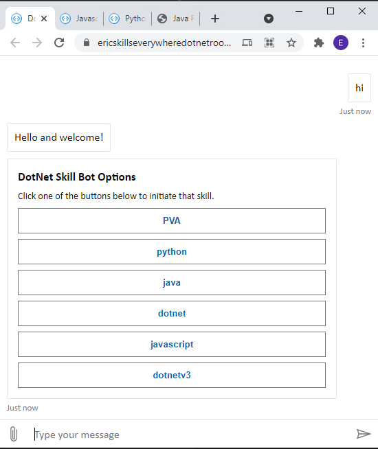

# SkillPlayground

## Contents

These projects are modified versions of sample 80 from [BotBuilder-Samples](https://github.com/microsoft/BotBuilder-Samples)

- [Dotnet](https://skillsparentdotnet.azurewebsites.net/)
- [setup](https://github.com/microsoft/BotBuilder-Samples/tree/master/samples/csharp_dotnetcore/80.skills-simple-bot-to-bot)

# 

- [Node](https://skillsparentnode.azurewebsites.net/index.html)
- [setup](https://github.com/microsoft/BotBuilder-Samples/tree/master/samples/javascript_nodejs/80.skills-simple-bot-to-bot)

# 

- [Python](https://skillsparentpython3.azurewebsites.net/index.html)
- [setup](https://github.com/microsoft/BotBuilder-Samples/tree/master/samples/python/80.skills-simple-bot-to-bot)

# 

- V3
    - Echo bot based on Skills Token validation changes in https://github.com/microsoft/BotBuilder-V3/tree/eric/skillsDraft2
