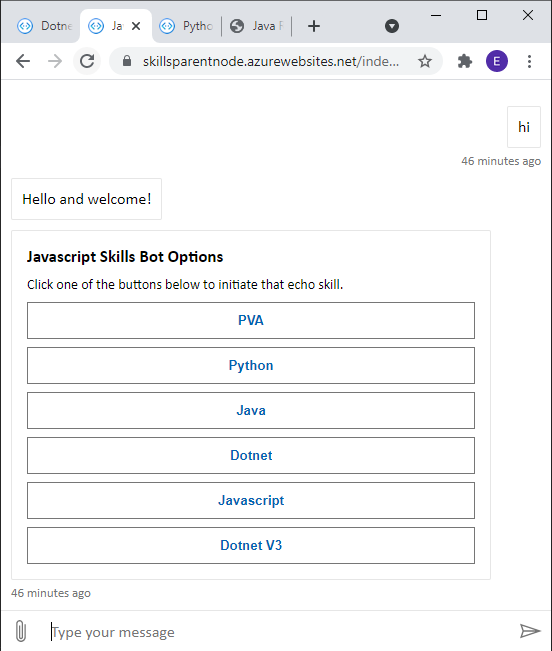

# SkillPlayground

## Contents

These projects are modified versions of sample 80 from [BotBuilder-Samples](https://github.com/microsoft/BotBuilder-Samples)

- [dotnet](https://ericskillseverywheredotnetroot.azurewebsites.net/)
- [setup](https://github.com/microsoft/BotBuilder-Samples/tree/master/samples/csharp_dotnetcore/80.skills-simple-bot-to-bot)
- [manifest](https://ericv3skillspizzabot.azurewebsites.net/wwwroot/dotnet.json)

# 

- [node](https://skillsparentnode.azurewebsites.net/index.html)
- [setup](https://github.com/microsoft/BotBuilder-Samples/tree/master/samples/javascript_nodejs/80.skills-simple-bot-to-bot)
- [manifest](https://ericv3skillspizzabot.azurewebsites.net/wwwroot/javascript.json)

# 

- [python](https://skillsparentpython3.azurewebsites.net/index.html)
- [setup](https://github.com/microsoft/BotBuilder-Samples/tree/master/samples/python/80.skills-simple-bot-to-bot)
- [manifest](https://ericv3skillspizzabot.azurewebsites.net/wwwroot/python.json)

# 

- [java](https://ericskillseverywherejavaroot.azurewebsites.net/)
- [setup](https://github.com/microsoft/BotBuilder-Samples/tree/main/samples/java_springboot/80.skills-simple-bot-to-bot)
- [manifest](https://ericv3skillspizzabot.azurewebsites.net/wwwroot/java.json)

# 

- V3
    - Echo bot using SkillBotAuthentication from v3.21.0 in https://botbuilder.myget.org/gallery/botbuilder-v3-dotnet-daily
